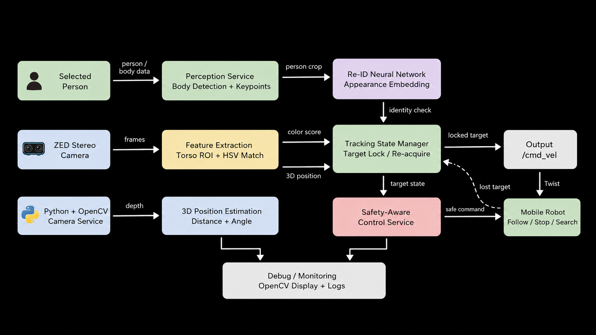

# Human-Aware Visual Tracking System
### Real-Time Person Following, Target Re-Identification, and Safety-Aware Control with ZED Stereo Vision


##  Project Overview
The goal of this project is to recognize a selected person, lock onto them, and follow them safely as they walk through a changing environment. I developed this system for a mobile robot using ZED stereo vision, body tracking, color-based target selection, and person re-identification.

The main technical challenge is that person-following is difficult in real-world environments. The environment can change quickly, someone may block the camera, lighting conditions may shift, and another person may appear wearing similar colors. When this happens, a simple tracking system can lose the target or start following the wrong person.

To solve this, the system uses multiple signals instead of relying on only one method. It combines torso-region color detection, 3D position tracking, target-locking logic, and AI-based re-identification to decide whether the detected person is the same person the robot was following or a different person.

The practical goal is to support hands-free mobile assistance. A robot like this could carry heavy tools, equipment, or supplies while simply following a person as they walk. This could be useful in busy spaces such as hospitals, airports, campuses, warehouses, and laboratories, where the robot needs to follow reliably without losing the selected person.


<video src="https://github.com/user-attachments/assets/6ef8f8bb-d1a6-4df6-95c7-5e376df29d8e" 
       controls="controls" 
       autoplay="autoplay" 
       muted="muted" 
       loop="loop" 
       style="max-width: 100%;">
  Your browser does not support the video tag.
</video>


## Software Architecture
Below the diagram shows the modular architecture of the current system. The logic is separated into camera input, perception, feature extraction, identity/state management, and safety-aware control.
<p align="center">
  
</p>

## Body Keypoints

This project uses ZED BODY_38 keypoints to estimate the torso region of a detected person. Shoulder and hip keypoints are used to define the shirt area for HSV color matching.

<p align="center">
  
</p>

<p align="center">
  <em>ZED BODY_38 keypoint layout used for torso-region extraction.</em>
</p>

##  Technical Stack & Setup

### Technical Stack

**Hardware**
- **Mobile Base:** [AgileX Tracer](https://global.agilex.ai/products/tracer)
- **Vision & Depth:** [Stereolabs ZED](https://www.stereolabs.com/en-us)
- **LiDAR:** [Ouster OS1](https://ouster.com/products/hardware/os1-lidar-sensor)

**Software**
- **[Python](https://www.python.org/)** – main implementation language
- **[OpenCV](https://opencv.org/)** – image processing, bounding boxes, and UI overlays
- **[NumPy](https://numpy.org/) / [SciPy](https://scipy.org/)** – distance calculations and heading geometry
- **[ZED SDK](https://www.stereolabs.com/en-us/developers/release) / [pyzed](https://www.stereolabs.com/docs/app-development/python/install)** – stereo vision, depth, and body tracking
- **[TensorRT](https://developer.nvidia.com/tensorrt) / [PyCUDA](https://documen.tician.de/pycuda/)** – optional OSNet Re-ID inference
- **[ROS2](https://docs.ros.org/en/humble/index.html)** – optional robot-control interface for publishing velocity commands


### Installation

```bash
# Clone the repository
git clone https://github.com/bagherhasani/Zed-Detection.git
cd Zed-Detection

# Create a virtual environment to keep it clean
python3 -m venv .venv
source .venv/bin/activate


# Install Python dependencies
pip install numpy opencv-python scipy

# Install ZED Python API
pip install pyzed


# Run the project
python3 zed-color.py
```


## Engineering Challenges

### Target Consistency and Re-Identification

A simple color tracker can lose the target when the person is occluded, lighting changes, or another person appears with similar clothing. To reduce accidental switching, I added target-locking logic and optional AI-based Re-ID using appearance embeddings.

### Real-Time Position and Heading Estimation

The system uses the ZED camera's 3D body position to estimate the target's distance and heading relative to the robot.

- **Distance:** `d = sqrt(x² + y² + z²)`
- **Heading:** `theta = atan2(x, z)`

These values are used to generate safe following behavior, including turning toward the target, maintaining a desired distance, and stopping when the target is too close.

### Safety and Find Control

The control logic uses conservative speed limits and safety rules. The robot stops when the target is too close and rotates in place when searching instead of moving forward blindly.


